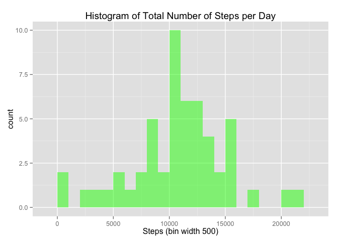
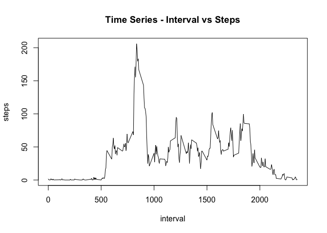
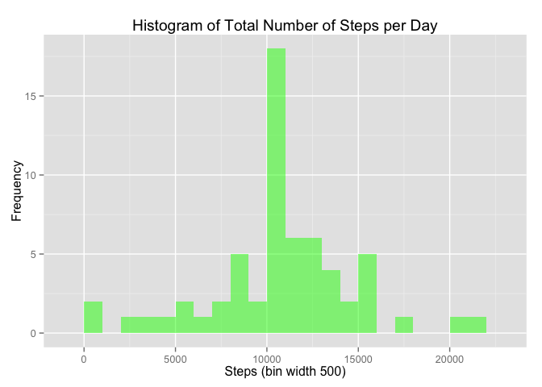
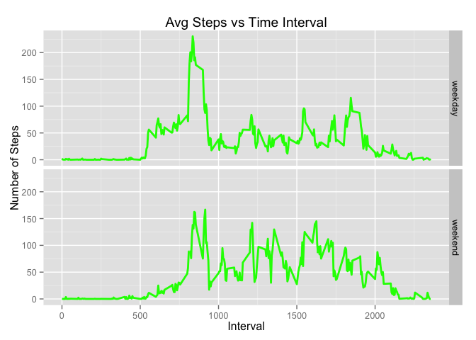

# Reproducible Research: Peer Assessment 1

## Load Libraries

```r
library(ggplot2)
```


##Load the data 

```r
a_data<-read.csv("activity.csv")
head(a_data)
```

```
##   steps       date interval
## 1    NA 2012-10-01        0
## 2    NA 2012-10-01        5
## 3    NA 2012-10-01       10
## 4    NA 2012-10-01       15
## 5    NA 2012-10-01       20
## 6    NA 2012-10-01       25
```
##Process/transform the data 

```r
a_data$date <- as.Date(a_data$date)
head(a_data)
```

```
##   steps       date interval
## 1    NA 2012-10-01        0
## 2    NA 2012-10-01        5
## 3    NA 2012-10-01       10
## 4    NA 2012-10-01       15
## 5    NA 2012-10-01       20
## 6    NA 2012-10-01       25
```

##Calculate the total number of steps taken per day

```r
steps_per_day1 <- aggregate(steps ~ date, a_data, sum)
names(steps_per_day1) <- c("date","steps")
str(steps_per_day1)
```

```
## 'data.frame':	53 obs. of  2 variables:
##  $ date : Date, format: "2012-10-02" "2012-10-03" ...
##  $ steps: int  126 11352 12116 13294 15420 11015 12811 9900 10304 17382 ...
```

##Histogram of total number of steps taken each day

```r
histogram_plot <- ggplot(steps_per_day1,aes(x = steps)) + 
        ggtitle("Histogram of Total Number of Steps per Day") + 
        xlab("Steps (bin width 500)") + 
        geom_histogram(alpha=0.5, fill="green",binwidth = 1000)
histogram_plot
```

 

##Calculate the mean the total number of steps taken per day

```r
mean(steps_per_day1$steps, na.rm=TRUE)
```

```
## [1] 10766.19
```

##Calculate the  median of the total number of steps taken per day

```r
median(steps_per_day1$steps, na.rm=TRUE)
```

```
## [1] 10765
```

##What is the average daily activity pattern?

```r
steps_interval <- aggregate(steps ~ interval, data = a_data, FUN = mean)
plot(steps_interval, type="l", main="Time Series - Interval vs Steps") 
```

 

##Which 5-minute interval, on average across all the days in the dataset, contains the maximum number of steps?

```r
steps_interval$interval[which.max(steps_interval$steps)]
```

```
## [1] 835
```

##Imputing Missing Values

Calculate and report the total number of missing values in the dataset (i.e. the total number of rows with NAs)

```r
sum(is.na(a_data))
```

```
## [1] 2304
```

Replacement data is the number of steps per interval averaged over all days

```r
replacements <- aggregate(steps ~ interval, a_data, mean, na.action = na.omit)$steps
```

A new dataset that is equal to the original dataset but with the missing data filled in.

```r
a_data_imputed<-transform(a_data, steps = ifelse(is.na(a_data$steps), replacements, a_data$steps))
```
Histogram of the total number of steps taken each day

```r
steps_imputed <- aggregate(steps~date,a_data_imputed,sum)

histogram_plot <- ggplot(steps_imputed,aes(x = steps)) + 
        ggtitle("Histogram of Total Number of Steps per Day") + 
        xlab("Steps (bin width 500)") + 
        ylab("Frequency") +
        geom_histogram(alpha=0.5, fill="green",binwidth = 1000)
histogram_plot
```

 

Calculate and report the mean number of steps taken per day. 

```r
mean(steps_imputed$steps, na.rm=TRUE)
```

```
## [1] 10766.19
```
Calculate and report the median total number of steps taken per day. 

```r
median(steps_imputed$steps, na.rm=TRUE)
```

```
## [1] 10766.19
```

Do these values differ from the estimates from the first part of the assignment?

We see that the mean is the same

We see the median is slightly higher 

##Are there differences in activity patterns between weekdays and weekends?
replace the data with the week day name

```r
 a_data_imputed$day<-weekdays(a_data_imputed$date)
```

pluck out the days that being with 'S' (Saturday & Sunday) and add a column for a weekend or weekday flag

```r
 a_data_imputed$weekend <- grepl("^S", a_data_imputed$day)
 a_data_imputed$day_or_end <- factor(a_data_imputed$weekend, levels = c(F, T), labels = c("weekday", "weekend"))
```

average number of steps taken, averaged across all weekday days or weekend days (y-axis)

```r
avg_steps_per_interval_imputed <- aggregate(steps ~ interval + day_or_end, a_data_imputed, mean)


avg_steps_plot <- ggplot(avg_steps_per_interval_imputed, aes( x = interval, y = steps)) +
        facet_grid(day_or_end ~ .) +
        geom_line(colour = "green", size=1) +
        xlab("Interval") +
        ylab("Number of Steps") + 
        ggtitle("Avg Steps vs Time Interval") 
avg_steps_plot
```

 
